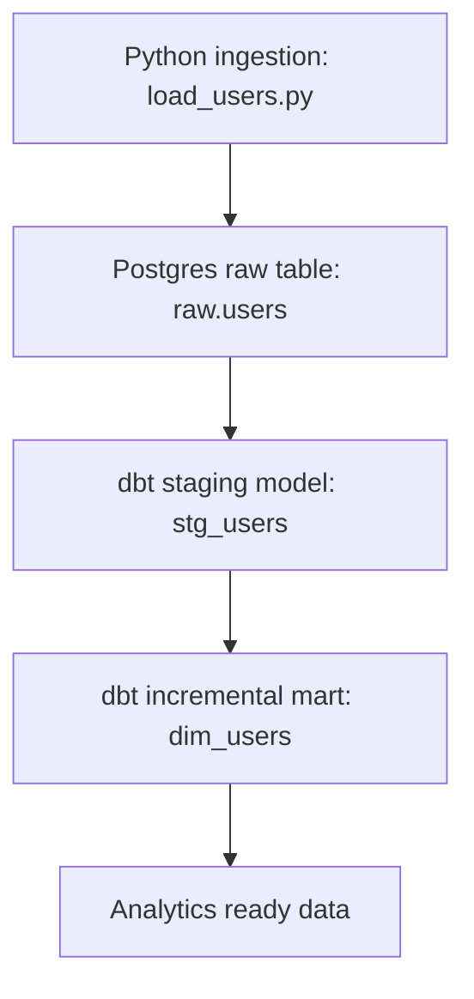
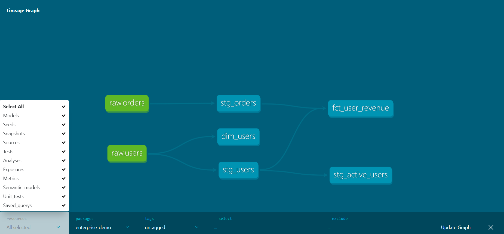

# Python + dbt Data Pipeline Demo

This project demonstrates a production-style data pipeline combining Python ingestion and dbt transformations on Postgres.

The pipeline includes:

• Python ingestion with idempotent upserts  
• Postgres warehouse raw layer  
• dbt staging models  
• dbt incremental mart model  
• Data tests and schema enforcement  

The pipeline loads data into `raw.users` and builds an incremental dimension model `dim_users` using dbt.

The dbt model `dim_users` uses incremental materialization with `unique_key = id` to support idempotent updates.

---

## Data Pipeline Architecture

## dbt Lineage

The dbt lineage graph shows how raw ingestion tables are transformed
into analytics-ready models.

## How to Run 
### 1. Install dependencies 
pip install -r ingestion/requirements.txt 

### 2. Run ingestion 
python ingestion/load_users.py 

### 3. Run dbt transformations 
cd enterprise_demo 
dbt build 

### 4. Verify results 
SELECT * FROM raw.users; 
SELECT * FROM dim_users;